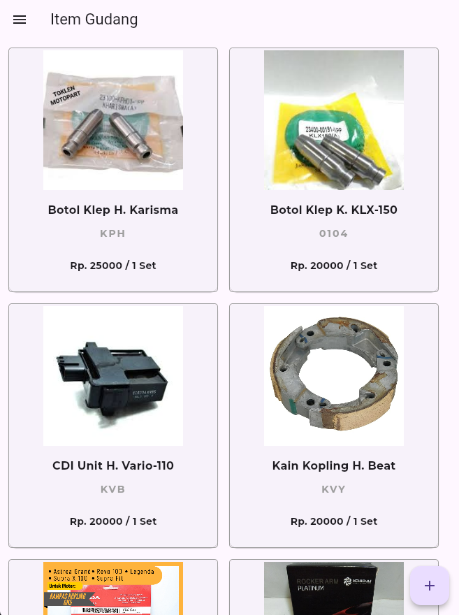
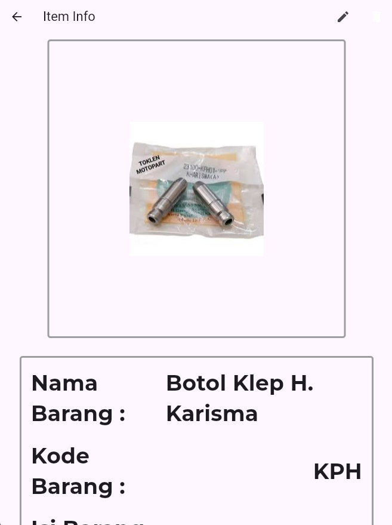
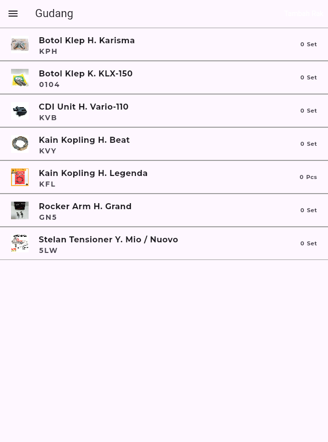
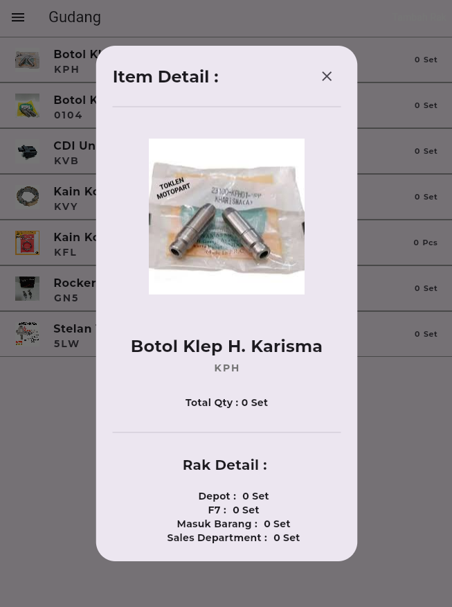

# Mobile Product Catalog (Early R&D)
## Overview
This was my foundational project in mobile development, created in 2023. It was designed to digitalize a physical motorcycle spare parts catalog into a portable, real-time digital system. The application allows field teams and warehouse staff to access product data, check item details, and manage inventory inputs on the go.

## Technical Stack
Framework: Flutter

Language: Dart

Primary Focus: UI/UX Architecture, State Management, and Navigation Workflows

## Key Features
Warehouse Catalog (Gudang): A grid-based view displaying spare parts with images, codes, and pricing.

Item Detail Insights: Interactive modals providing specific data like "Kode Barang," "Satuan," and "Persamaan" (cross-references).

Inventory Input: A dedicated form module to add new items into the system digital registry.

Multi-Module Navigation: A structured drawer menu for seamless switching between Warehouse, Item List, and Reception modules.

## Project Evolution
This project served as the initial Research & Development (R&D) phase for what eventually became a much larger mobile ecosystem. The logic and architectural decisions made here paved the way for more complex enterprise systems, including my recent work on ERP migrations and automated warehouse management.

## Important Note for Reviewers
Note: This repository is provided for code architecture and logic review only. The original database connection is currently inactive as this was a proprietary internal R&D project. Screenshots are provided in the assets folder to demonstrate the fully functional UI.

## Preview

  
  
  
  

